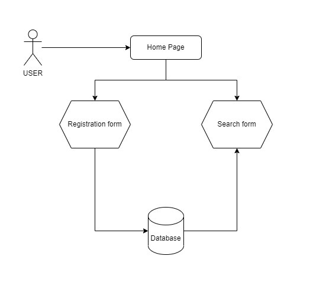
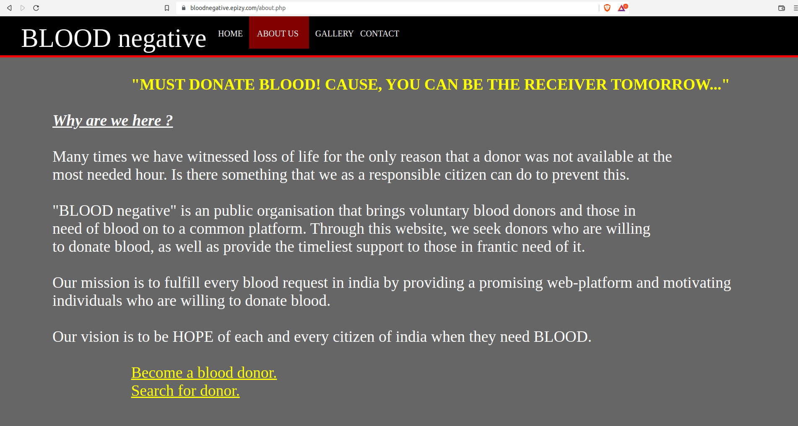
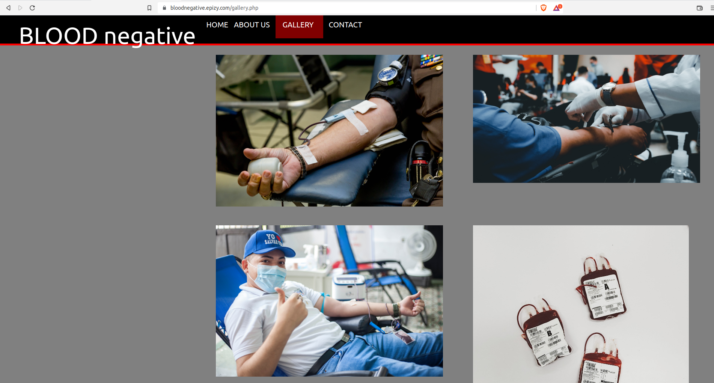
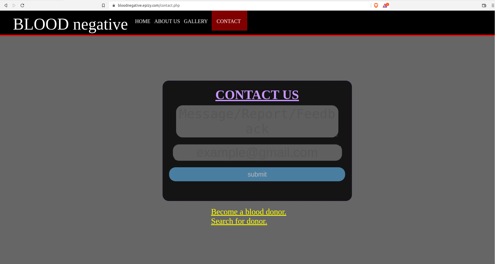
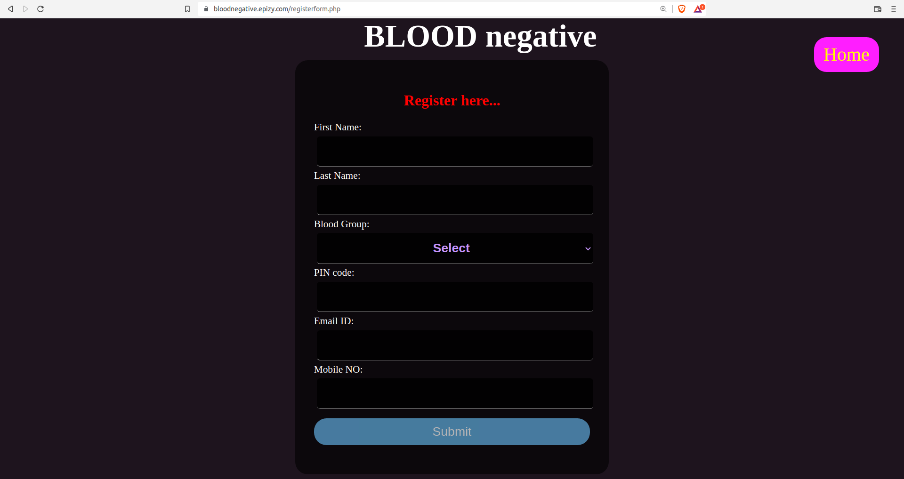
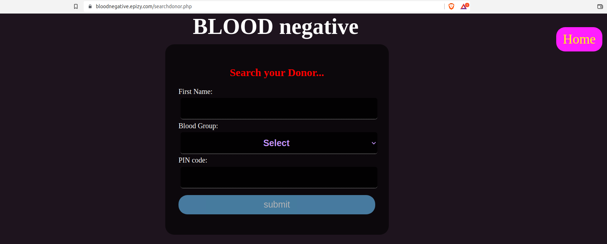

## [BLOODnegative](https://bloodnegative.epizy.com/){:target="_blank"}

This was my very first college project where I developed a fully functional dynamic website and deployed over internet using _InfinityFree_. 

**To view website _[click here]_(https://bloodnegative.epizy.com/){:target="_blank"}**

### Requirements

1. HTML
2. CSS
3. JavaScript
4. PHP 
5. SQL 
6. MySQL
7. XAMPP 

### Flow Diagram

### About the Platform

- **Home Page**: When you first visit a website, it displays an elegant home page, like the one below, with information on upcoming donation camps and links to register as donors or search for donors.

- **About Us**: This contains a summary of the significance of the _Blood Negative_ platform in modern society and how it might benefit patients. 

- **Gallery**: It helps to encourage blood donation by displaying pictures of blood donation camps.

- **Contact us**: This offers a feedback form so users may express their opinions on the platform.

- **Register form**: Here, you can register to become a donor by providing your basic contact information and blood type.

- **Search form**: By entering your blood group and area code, you can find the needed donor.

### How it works

The actual working of the platform solely depends on the two entities _PIN Code_ and _Blood group_. We ask users to supply this information when they sign up to be blood donors; afterwards, when a patient searches for the Donor, they must also provide the same information. We then apply a filter to the data based on these parameters to show the corresponding blood donors.
    
### Jekyll Themes

Your Pages site will use the layout and styles from the Jekyll theme you have selected in your [repository settings](https://github.com/ursmaheshj/BLOODnegative/settings/pages). The name of this theme is saved in the Jekyll `_config.yml` configuration file.

### Support or Contact

Having trouble with Pages? Check out our [documentation](https://docs.github.com/categories/github-pages-basics/) or [contact support](https://support.github.com/contact) and we’ll help you sort it out.
