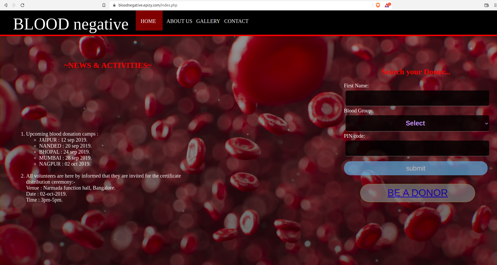

## BLOODnegative

This was my first college project where i build a fully functional website using HTML, CSS and JavaScript at frontend and backend with PHP.

### About the Platform

- **Home Page**: When you first visit a website, it displays an elegant home page, like the one below, with information on upcoming donation camps and links to register as donors or search for donors.



- **About Us**: This is contains a summary of the significance of the _Blood Negative_ platform in modern society and how it might benefit patients. 


- **Gallery**: It helps to encourage blood donation by displaying pictures of blood donation camps.


- **Contact us**: This offers a feedback form so users may express their opinions on the platform.


- **Register form**: Here, you can register to become a donor by providing your basic contact information and blood type.


- **Search form**: By entering your blood group and area code, you can find the needed donor.


- 

    
```
# Header 1
## Header 2
### Header 3

- Bulleted
- List

1. Numbered
2. List

**Bold** and _Italic_ and `Code` text

[Link](url) and 
```

For more details see [Basic writing and formatting syntax](https://docs.github.com/en/github/writing-on-github/getting-started-with-writing-and-formatting-on-github/basic-writing-and-formatting-syntax).

### Jekyll Themes

Your Pages site will use the layout and styles from the Jekyll theme you have selected in your [repository settings](https://github.com/ursmaheshj/BLOODnegative/settings/pages). The name of this theme is saved in the Jekyll `_config.yml` configuration file.

### Support or Contact

Having trouble with Pages? Check out our [documentation](https://docs.github.com/categories/github-pages-basics/) or [contact support](https://support.github.com/contact) and we’ll help you sort it out.
